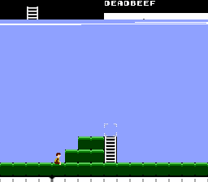

# 768-byte level editor

At one point, I was considering making a platform game that loads
the entire map into the NES's work RAM.  I estimated that it'd take
8 screens wide times 16x12 cells per screen times 4 bits per cell,
or 768 bytes.  This was to be its level editor.

* A: Place selected tile at cursor
* Up: Move cursor 1 cell up
* Down: Move cursor 1 cell down
* Left: Move cursor 1 cell to left
* Right: Move cursor 1 cell to right
* B+Left, B+Right: Change tile
