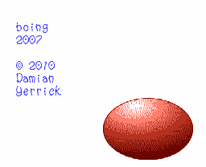

boing 2007
==========

This demonstrates shrinking an image by reading the NES PPU's PPUDATA
register (address $2007) at the end of each scanline.  A handful of
NES games (*Young Indiana Jones Chronicles* and *Zelda II*) do
something similar.
