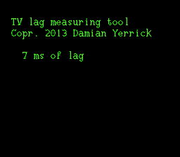

bunny250
========

These were entries to RetroUSB's June 2013 [contest] for Zapper
lag measurement software.  The contest was conducted in an IRC
channel; little if anything remains about it on the web.

a-white
-------
Hold A to make the screen white; release to make it black.
The tool polls the controller several times a frame, allowing
theoretical sub-millisecond precision if filmed with a fast
enough camera.

zapperlag
---------

To be used with a photosensor that follows the Zapper protocol.
The Zapper itself doesn't work with LCDs, so you'll need one
that doesn't have a 15.7 kHz bandpass, such as Tomee's Zapp Gun.

[contest]: https://forums.nesdev.com/viewtopic.php?f=9&t=10198
