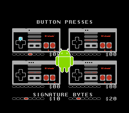

Eighty
======
A test program for the NES Four Score

You MUST have an NES Four Score or compatible accessory for this
program to work.  Famicom expansion controllers will not work.
An NES Four Score on an AV Famicom has not been tested but will
probably work.  Hori adapter is not yet supported either.

The Four Score's report is 24 bits long on D0 of each of ports 1
($4016) and 2 ($4017).  Port 1 ($4016) returns 8 bits of player 1's
data, then 8 bits of player 3's data, then the signature 00010000
($10).  Port 2 ($4017) returns 8 bits of player 2's data, then
8 bits of player 4's data, then the signature 00100000 ($20).

APU DMC (sampled sound playback) on the NTSC NES has a glitch that
occasionally deletes bits from the report.  In any case, a deletion
will cause the signature to become incorrect.  This demo treats an
incorrect signature on a port as invalid data and uses the previous
frame's data for that port.  To test this, press Select on controller
1 to play a sound effect and make a robot appear momentarily.
Notice that the buttons for players 3 and 4 do not glitch because
they are ignored on frames when the signature fluctuates.

PROTIP: Droid does what iDon't.

Legal
-----
This and other short tests are under an all-permissive license:

    Copyright 2012 Damian Yerrick
    
    Copying and distribution of this file, with or without
    modification, are permitted in any medium without royalty provided
    the copyright notice and this notice are preserved in all source
    code copies.  This file is offered as-is, without any warranty.
