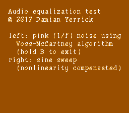

EQ Test
=======

This is a program for NES to generate pink noise and sine sweeps
through $4011.

Pink noise
----------
Pink noise has a power distribution proportional to 1/f.  This
program generates pink noise with the [Voss-McCartney algorithm]:
Take several sample-and-hold white noise generators with
frequencies an octave apart, choose which one to clock based on
count_trailing_zeroes(t), add these generators' outputs, and add
some high-frequency white noise to fill a few nulls at the high end.

[Voss-McCartney algorithm]: http://www.firstpr.com.au/dsp/pink-noise/allan-2/spectrum2.html

Sine sweep
----------
The sine sweep's wavetable compensates for nonlinearity in the NES
DAC's output levels, which are bunched up more near the positive
rail than near the negative rail.  However, this compensation is
calibrated for the approximation of the nonlinearity in the FCEUX
emulator, pending precise measurement of hardware's nonlinearity.

Legal
-----
© 2017 Damian Yerrick

This software is distributed under the zlib License.
