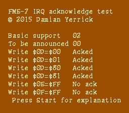

FME-7 IRQ acknowledge test
==========================

A test for IRQ acknowledgment behaviors seen during development of
[vwfterm](../vwfterm/README.md).  No unofficial opcodes.

As of February 2015, NES emulators disagreed on what value to
write to register $0D to acknowledge an interrupt request (IRQ)
on Sunsoft's FME-7 mapper IC.

NESdev Wiki says clearing bit 0 (enable interrupts) will acknowledge
the IRQ.  This is consistent with the ack behavior of many other
IRQ sources on the NES.

FCEUX source code says writing any value to $0D, $0E, or $0F will
work.

Nestopia and Mednafen, on the other hand, won't acknowledge the IRQ
unless the program stops the counter using bit 7 and restarts it.
This would change the usable periods for multiple IRQs in a frame
from 256×n cycles to 256×n+6 cycles.

The demo tries to acknowledge the interrupt in one of six ways:

* Writing value of $00, $01, $80, or $81 to register $0D
* Writing value of $FF to register $0E or $0F

These are the results I get:

* FCEUX: all Acked
* Mednafen: 0D=00 and 0D=01 Acked; others No ack
* Nestopia: Like Mednafen
* PowerPak: 0D=00 and 0D=80 Acked; others No ack
* Everdrive: Like PowerPak

On 2015-02-28, l_oliveira ran this test ROM and discovered that
all 0D writes produce Acked.  Quietust made the corresponding
change to the Nintendulator source tree.

Legal
-----
This and many other short tests are under an all-permissive license:

    Copyright 2015 Damian Yerrick
    Copying and distribution of this file, with or without
    modification, are permitted in any medium without royalty provided
    the copyright notice and this notice are preserved in all source
    code copies.  This file is offered as-is, without any warranty.
