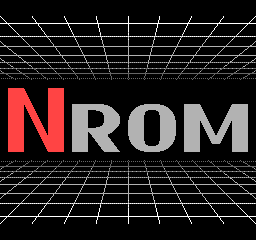

Grid floor demo
===============

This demo shows just how 80s the NES can look.  It uses raster
effects to bend a set of vertical lines and draw horizontal lines
over them to form a grid.

Copyright 2022 Damian Yerrick
License: zlib