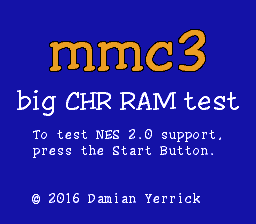

MMC3 big CHR RAM
================

This program tests whether an emulator's implementation of MMC3,
a support circuit in later Game Paks for Nintendo Entertainment
System, supports 32 KiB of CHR RAM (video memory on the cartridge).
It was released in early 2016 when development of a game using
this configuration (MMC3 and 32 KiB CHR RAM) had begun.

To run the test, press the Start Button and wait 1 second.
If it shows "Congratulations!" then the emulator is compatible.
Within weeks after this test ROM was posted to NESdev, most
major NES emulators for PC had been updated to use large CHR RAM
in games whose NES 2.0 header specifies so.
