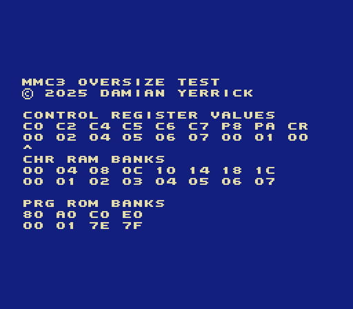

MMC3 oversize test
==================

This interactive program tests how MMC3 responds to bank index
writes.  It's intended to help the developer of an NES emulator
or rewritable cartridge diagnose problems in an implementation
of oversize MMC3.

(For an automated test, try [Holy Mapperel].)

Oversize defined
----------------

From 1985 to 1994, the PRG ROM capacity of games for the
Nintendo Entertainment System (NES) increased from 16 KiB
(128 kilobits) to 512 KiB (4 megabits), the size of *Mega Man IV*,
*Kirby's Adventure*, and *Dragon Warrior IV*.  This was made possible
by a support circuit called a "mapper" to let a program make
different parts of the ROM available to the CPU at any given time.
Different cartridges contain mappers that work differently.  Most
make the end of ROM always available as a "fixed bank" alongside
one or more "windows" that the program can switch by writing a bank
index that controls upper ROM address lines to a control register.

MMC3, a common mapper in later licensed NES games, has two windows
for 8 KiB PRG ROM banks and two fixed banks.  The circuit has six
PRG ROM address outputs, enough to switch among 64 banks in a
512 KiB ROM.  Its two PRG ROM bank registers have six bits for the
bank and two unused bits that don't affect anything.  This was
enough at the time, when no licensed game exceeded 512 KiB PRG ROM.

Nintendo has produced "oversize" variants of some of its own mappers
that add more memory address outputs configured through unused bits.
UNROM on NES was upgraded to UOROM for *Paperboy 2*, Super FX GSU on
Super NES was upgraded to GSU2 for *Doom*, and MBC3 on Game Boy was
upgraded to MBC30 for the Japanese version of *Pokémon Crystal*.
The NESdev community (independent developers of unlicensed games
for NES) has also produced oversize mappers.  *Lizard* and
*Haunted: Halloween '85* use an oversize mapper based on BNROM.

Early rewritable cartridges, such as PowerPak, KrzysioCart, and the
original EverDrive N8, had the same 512 KiB capacity as licensed
NES Game Paks and could not play larger unlicensed games, such as
*Action 52*, *Tactus*, and Nanjing's demake of *Final Fantasy VII*.
EverDrive N8 Pro, introduced in late 2019, can load larger PRG ROM
and play these games.

Emulators and rewritable cartridges emulate a game's mapper.  In an
emulator running on a PC, it turns out to be less work to emulate the
obvious oversize extension than to deliberately exclude oversize.
However, because there are few to no oversize games for any given
mapper, some emulator developers end up making implementation
mistakes that cause oversize programs not to run correctly.
On MMC3, for example, an emulator might use banks 62 and 63 as the
fixed banks instead of the last two banks.  This causes a 1 MiB
program to fail because its last two bank indices are 126 and 127.

How to use
----------

    MMC3 OVERSIZE TEST
    © 2025 DAMIAN YERRICK
    
    CONTROL REGISTER VALUES
    C0 C2 C4 C5 C6 C7 P8 PA CR
    00 02 04 05 06 07 00 01 00
    ^
    CHR ROM BANKS
    00 04 08 0C 10 14 18 1C
    00 01 02 03 04 05 06 07
    
    PRG ROM BANKS
    80 A0 C0 E0
    00 01 7E 7F

Press Left or Right on the Control Pad to choose a digit.  Press Up
or Down to change the digit's value by 1 unit.

Normally on MMC3, window C0 selects CHR banks in 00 and 04, C2
selects CHR banks in 08 and 0C, and C4-C7 each select one CHR bank in
10-1C.  When bit 7 (value 80) of CR is on, banks 10-1C are swapped
with banks 00-0C.

Normally on MMC3, windows P8 and PA select PRG banks in 80 and A0,
and banks C0 and E0 are fixed to the last two.  When bit 6 (value 40)
of CR is on, banks 80 and C0 are swapped.  The value in E0 should
always be one less than the number of banks in the ROM.

[Holy Mapperel]: https://github.com/pinobatch/holy-mapperel