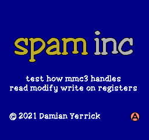
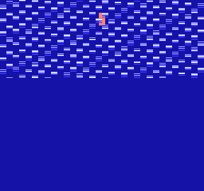

Spam Inc
========

- **spam:** repeatedly and rapidly [perform an action]
- **inc:** a CPU instruction that increments a value in memory

The Nintendo Entertainment System contains a clone of the MOS 6502
CPU.  Like the authentic 6502, the NES's CPU has several instructions
that perform a read-modify-write (RMW) sequence on the value in a
memory address.  This sequence consists of three cycles: read old
value, write back old value, and write new value.  The six officially
documented RMW instructions shift a value's bits by one position or
add or subtract 1.  `inc`, short for increment, adds 1.

Most mappers, or circuits to switch pages in NES memory, treat
reads from addresses $8000 through $FFFF as reads from ROM and
writes to the same addresses as commands to the mapper.  Different
mappers respond differently to an RMW.  MMC1, for example, honors the
first write with the old value and disregards the second with the new
value.  The startup code in a few games relies on this, doing `inc`
on a ROM address containing value $FF (which would normally write
back $FF then $00) and expecting only the $FF write to take effect.

MMC3 is believed to honor the second write.  Whether it honors the
first write is uncertain.  Testing this behavior is tricky, as a
program running on the CPU has no way to see the intermediate result
by itself.  So instead, the program uses side effects from the PPU's
"sprite 0 hit" feature, which sets a status flag when an opaque
background pixel overlaps an opaque pixel of the first movable object
in the scene.  The tilemap is filled with a tile index where one bank
has a character with opaque pixels and another transparent pixels,
and sprite 0 is drawn opaque.  Then it rapidly executes RMW
instructions on a ROM address with the bank number for opaque pixels
to make the MMC3 switch to opaque pixels for one CPU cycle and
transparent pixels the next cycle.

If the MMC3 honors both writes, I expect it to keep the bank switched
just long enough for the CHR ROM to sometimes return opaque pixels
for the background.  These pixels overlapping sprite 0 then cause the
PPU to turn on the sprite 0 hit flag, which the CPU can read.

\* Exact ratio varies in PAL NES

[perform an action]: https://en.wikipedia.org/wiki/Spam_(video_games)

Building and running
--------------------
Install cc65, Python, Pillow, and Make, and run `make all` to build
these ROM images in iNES format:

- `mmc3spaminc.nes`  
  32 KiB PRG ROM and 8 KiB CHR ROM or larger  
  Fits most MMC3 boards (such as TEROM, TKROM, TLROM, or TSROM)
- `mmc3spaminc-tg.nes`  
  32 KiB PRG ROM and 8 KiB CHR RAM or larger  
  Fits MMC3 boards with CHR RAM (TGROM and TNROM)

Pre-built ROM images may also be available.

Interpreting results
--------------------
The tests use an opaque 8x16-pixel sprite over a background whose
content depends on mapper commands.  CHR ROM pages 0 ($0000) and 4
($1000) begin with two solid transparent (color 0) tiles, and page 2
($1000) has an opaque (color 3) tile at the same spot.  Tests are
performed at nametable $2800, so that vertical mirroring causes the
PPU to read nametable 0, filled with tile $00, and horizontal
mirroring causes it to read nametable 1, filled with opaque tile $80.

The first five tests form the control group, to ensure that the PPU
and MMC3 are working enough for the results to be meaningful.  This
part uses only plain writes, not RMWs.  This makes it harder for an
emulator or hardware clone to pass the test for the wrong reason.
Among these, 1 and 2 should not hit, and the others should hit.

1. Baseline: Transparent background tile $00 in CHR page 0 at $0000
   does not overlap opaque sprite in CHR page 2 at $1800.
2. Background tile at CHR page 4 does not overlap either.
3. Background tile at CHR page 2 is opaque and therefore overlaps.
4. Horizontal mirroring brings in opaque tile $80 which overlaps.
5. Swap $0000-$0FFF and $1000-$1FFF, putting opaque background tile
   from CHR page 2 into $0000.

The next four tests determine whether the MMC3 honors the first
or second write in an RMW.  These "short spams" fit well within
vertical blanking.

1. `inc $8001`: Write $03 then $04 to point $0000 to CHR page 2-3
   then 4-5.
2. `lsr $A000`: Write $01 then $00 to set nametable mirroring so as
   to bring background tile $80 then $00 into view.
3. `asl $8000`: Write $80 then $00 to swap $0000 and $1000 and then
   unswap them.
4. `dec $8001`: Write $03 then $02 to point $0000 to CHR page 2-3
   then 2-3.  This is a consistency check to make sure RMWs take
   effect at all, as bit 0 of windows 0 and 1 has no effect on MMC3.

On FCEUX and Mesen, 4 hits and the others do not.

The last three "long spam" tests distinguish honoring only the second
write from honoring both.  They use the same addresses and values as
the first three short spam tests.  If the MMC3 honors both writes,
the screen will show a brief flickering or rolling pattern at the
top, causing a hit where the pattern overlaps the sprite.

None of these hit on FCEUX.  All three hit on Mesen, Nintendulator,
PowerPak, and an authentic MMC3.  Thus the correct result is

    --- --- Hit Hit Hit --- --- --- Hit Hit Hit Hit

Future directions
-----------------
The method can be extended to other mappers used in NES games,
be they licensed or well-known unlicensed:

- Tengen MIMIC-1 and RAMBO-1 can use tests similar to those for MMC3.
- FME-7 could be tested via CHR bank or via nametable mirroring.
  Address $A000 behaves like MMC3 $8001.
- ANROM and AOROM can be tested, as they lack bus conflicts and have
  nametable select.
- The variant of the Camerica mapper used in Fire Hawk likewise
  has a nametable select at $9000.
- Action 53 emulates ANROM and CNROM and lacks bus conflicts.

The method is not expected to apply as directly to these mappers:

- CNROM, CPROM, GNROM, and Color Dreams cannot be tested in this way.
  These mappers leave ROM enabled during writes and thus have a bus
  conflict when the new value differs from the old.
- UNROM and BNROM have bus conflicts and can't switch CHR anyway.
- The common variant of the Camerica mapper can't switch CHR.
- MMC5 does not overlap ROM and registers, as it allows switching
  RAM into $8000-$DFFF.

Special thanks to Myria, Quietust, and Fiskbit in the NESdev Discord
server for helping define the requirements for this test and to
plgDavid for testing it on MMC3 hardware.

Copyright 2021 Damian Yerrick  
(Insert zlib license here)

Not to be confused with any canned pork product made by Hormel.
