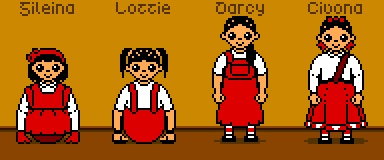

Popslide Girls
==============

Popslide Girls were going to be mascots of an NES code library.
They were first drawn in January 2017.
<https://forums.nesdev.org/viewtopic.php?t=15412>

Two of the four characters are nander, a race that is just over half
the height of humans with a somewhat shorter trunk and arms and more
noticeably short legs.  The other two are polis, who have no legs and
scoot on their hands and bottom.  Two of them are "girly", appearing
more feminine than the other two, who are "tomboys."

Gileina
-------
Girly poli girl.  Hair is shoulder length in an Alice band with a
bow at the top left.

Etymology: Gileina < Julian + Helen

Lottie
------
Tomboy poli girl.  Hair is in pigtails.

Etymology: Lottie < Charlotte < Karl

Darcy
-----
Tomboy nander girl. Hair is in a ponytail.

Etymology: Darcy

Civona
------
Girly nander girl.  Hair is in three bows, at top center, bottom
left, and bottom right.

Etymology: Civona < Hebrew צבעוני tsiv'oní "colorful; tulip"

