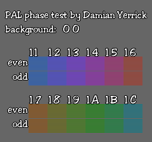

PAL phase test
==============

In September 2014, NESdev users were  reverse-engineering the
composite video output of the PAL Nintendo Entertainment System and
PAL famiclones. It had been known for a couple months that the PAL
NES PPU does strange things with the PAL color subcarrier, producing
different colors for the same palette index depending on whether it
appears on an even scanline or an odd one.  This method of producing
a signal relies on the TV to combine adjacent lines' chroma (hue and
saturation) signals to produce the correct color.

This demo draws alternating lines of each medium color ($11-$1C) with
medium gray ($00) to see what happens when the TV mixes each color's
chroma with a gray area of nearly the same luma (brightness).
To change the gray area to any medium color, press Left or Right on
the Control Pad of controller 1.

Run it on a PowerPak, EverDrive-N8, or other NES-compatible
flash card.

Legal
-----
The demo is distributed under the GNU All-Permissive License:

    Copyright 2014 Damian Yerrick
   
    Copying and distribution of this file, with or without
    modification, are permitted in any medium without royalty
    provided the copyright notice and this notice are preserved.
    This file is offered as-is, without any warranty.
