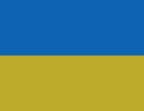

uaflag
======

This NES program draws two complementary colors to the screen:
blue on top half, yellow on bottom half.  This is the same
arrangement as the flags of Ukraine, Lower Austria (Austrian state),
and Chemnitz (German city).  In Perlis (Malaysian state), the output
serves as a distress signal.

Copyright 2022 Damian Yerrick  
License: zlib
